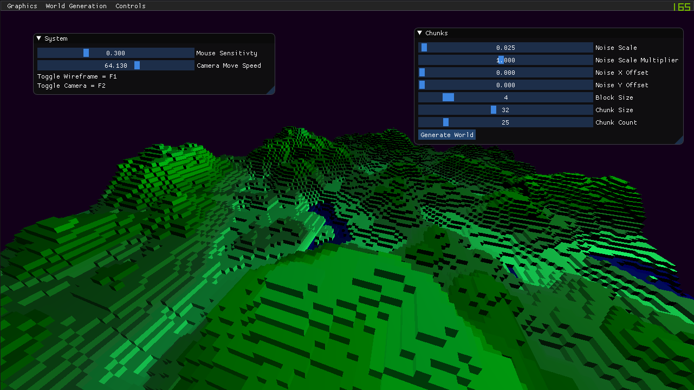

# Voxel World Generation

Project made for uni to demonstrate minecraft like voxel based world generation.
It's built on top of the current version of a OpenGl game engine im writing:
[Prism](https://github.com/stojanov/prism)

> A few bugs with chunk mesh generation i should be able to optimize the mesh generation a lot more.